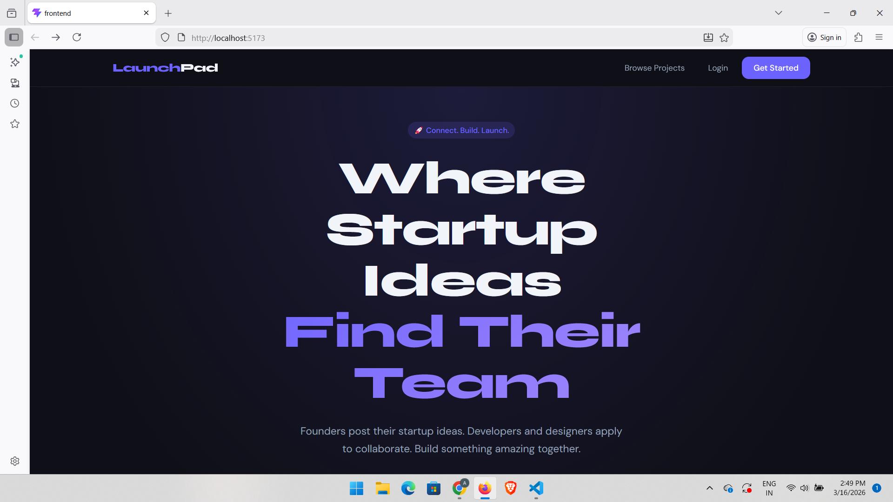
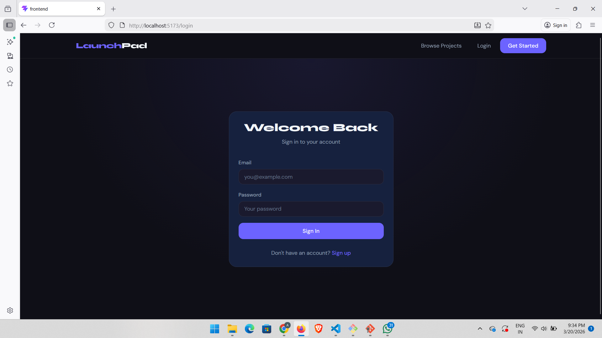

# 🚀 LaunchPad — Startup Collaboration Platform

A full-stack MERN web application where startup founders can post ideas and developers/designers can apply to collaborate.

---

## 📋 Table of Contents

- [Features](#features)
- [Tech Stack](#tech-stack)
- [Prerequisites](#prerequisites)
- [Installation](#installation)
- [Running the App](#running-the-app)
- [API Endpoints](#api-endpoints)
- [Project Structure](#project-structure)
- [Environment Variables](#environment-variables)

---

## ✨ Features

- User registration and login with JWT authentication
- Role-based accounts — Founder and Developer
- Founders can post, update, and delete startup projects
- Developers can browse projects and apply to collaborate
- Founder dashboard to manage projects and review applications
- Accept or reject applications with notifications
- Developer profile with skills and social links
- Real-time chat with Socket.io
- File upload via Cloudinary
- Responsive dark UI

---

## 🛠 Tech Stack

| Layer | Technology |
|---|---|
| Frontend | React (Vite), Redux Toolkit, React Router |
| Backend | Node.js, Express.js |
| Database | MongoDB, Mongoose |
| Auth | JWT, bcryptjs |
| File Upload | Multer, Cloudinary |
| Real-time | Socket.io |
| Styling | CSS Variables, Custom CSS |

---

## ✅ Prerequisites

Make sure you have the following installed before starting:

| Tool | Version | Download |
|---|---|---|
| Node.js | v18 or above | https://nodejs.org |
| MongoDB | Local or Atlas | https://www.mongodb.com |
| Git | Latest | https://git-scm.com |

You also need a free **Cloudinary** account:
- Sign up at https://cloudinary.com
- Copy your `Cloud Name`, `API Key`, and `API Secret`

---

## 📦 Installation

### Step 1 — Clone the Repository

```bash
git clone https://github.com/yourusername/startup-collaboration-platform.git
cd startup-collaboration-platform
```

---

### Step 2 — Backend Setup

```bash
cd backend
npm install
```

Create a `.env` file in the `backend/` folder:

```env
PORT=5000
MONGODB_URI=mongodb://127.0.0.1:27017/startup-platform
JWT_SECRET=your_super_secret_jwt_key
JWT_EXPIRES_IN=7d
NODE_ENV=development
CLOUDINARY_CLOUD_NAME=your_cloud_name
CLOUDINARY_API_KEY=your_api_key
CLOUDINARY_API_SECRET=your_api_secret
CLIENT_URL=http://localhost:5173
```

---

### Step 3 — Frontend Setup

```bash
cd ../frontend
npm install
```

---

## ▶️ Running the App

You need **two terminals** running at the same time.

### Terminal 1 — Start Backend

```bash
cd backend
npm run dev
```

You should see:
```
✅ MongoDB connected: 127.0.0.1
🚀 Server running on port 5000
📦 Environment: development
```

### Terminal 2 — Start Frontend

```bash
cd frontend
npm run dev
```

You should see:
```
VITE v8.x.x  ready in 300ms
➜  Local:   http://localhost:5173/
```

Open your browser and go to: **http://localhost:5173**

---

## 🔌 API Endpoints

### Auth
| Method | Endpoint | Description |
|---|---|---|
| POST | /api/v1/auth/register | Register new user |
| POST | /api/v1/auth/login | Login user |
| GET | /api/v1/auth/me | Get current user |
| POST | /api/v1/auth/logout | Logout user |

### Projects
| Method | Endpoint | Description |
|---|---|---|
| GET | /api/v1/projects | Get all projects |
| GET | /api/v1/projects/:id | Get project by ID |
| POST | /api/v1/projects | Create project (Founder) |
| PUT | /api/v1/projects/:id | Update project (Founder) |
| DELETE | /api/v1/projects/:id | Delete project (Founder) |
| GET | /api/v1/projects/founder/my | Get founder's projects |

### Applications
| Method | Endpoint | Description |
|---|---|---|
| POST | /api/v1/applications/project/:id | Apply to project (Developer) |
| GET | /api/v1/applications/my | Get my applications |
| GET | /api/v1/applications/project/:id | Get project applications (Founder) |
| PUT | /api/v1/applications/:id/status | Accept/Reject application |
| PUT | /api/v1/applications/:id/withdraw | Withdraw application |

### Users
| Method | Endpoint | Description |
|---|---|---|
| GET | /api/v1/users/:id | Get user profile |
| PUT | /api/v1/users/profile | Update profile |
| POST | /api/v1/users/upload-avatar | Upload avatar |

### Notifications
| Method | Endpoint | Description |
|---|---|---|
| GET | /api/v1/notifications | Get notifications |
| PUT | /api/v1/notifications/mark-all | Mark all as read |
| PUT | /api/v1/notifications/:id/read | Mark one as read |
| DELETE | /api/v1/notifications/:id | Delete notification |

---

## 📁 Project Structure

```
startup-platform/
├── backend/
│   ├── src/
│   │   ├── config/          # DB and Cloudinary config
│   │   ├── middlewares/     # Auth, role, upload, error handlers
│   │   ├── modules/
│   │   │   ├── auth/        # Register, Login, JWT
│   │   │   ├── users/       # Profile management
│   │   │   ├── projects/    # Project CRUD
│   │   │   ├── applications/# Apply, Accept, Reject
│   │   │   ├── notifications/# Notification system
│   │   │   └── chat/        # Socket.io real-time chat
│   │   └── utils/           # ApiResponse, ApiError, asyncHandler
│   ├── server.js
│   └── package.json
│
└── frontend/
    ├── src/
    │   ├── api/             # Axios API calls
    │   ├── components/      # Reusable components
    │   ├── pages/           # All page components
    │   ├── store/           # Redux store and slices
    │   ├── hooks/           # Custom React hooks
    │   └── routes/          # App routing
    ├── index.html
    └── package.json
```

---

## 🔐 Environment Variables

| Variable | Description |
|---|---|
| PORT | Backend server port (default: 5000) |
| MONGODB_URI | MongoDB connection string |
| JWT_SECRET | Secret key for JWT tokens |
| JWT_EXPIRES_IN | JWT expiry time (default: 7d) |
| NODE_ENV | development or production |
| CLOUDINARY_CLOUD_NAME | Your Cloudinary cloud name |
| CLOUDINARY_API_KEY | Your Cloudinary API key |
| CLOUDINARY_API_SECRET | Your Cloudinary API secret |
| CLIENT_URL | Frontend URL (default: http://localhost:5173) |

---

## 👥 User Roles

### Founder
- Post startup projects
- Review and manage applications
- Accept or reject collaborators
- Manage team members

### Developer
- Browse all projects
- Apply to collaborate
- Track application status
- Manage profile and skills

---

## 📝 License

This project was built as an internship project.

---

Built with ❤️ using the MERN Stack

## 📸 Screenshots

### Landing Page


### Browse Projects


### Project Details


### Founder Dashboard


### Login Page
